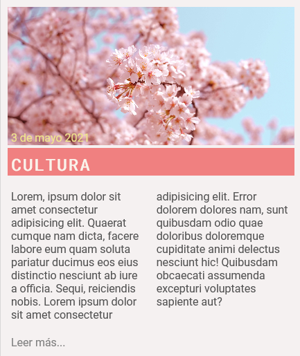

# S1. HTML i CSS

Avaluació
---------

<table class="generaltable" id="yui_3_17_2_1_1665314114587_60">
<tbody id="yui_3_17_2_1_1665314114587_59"><tr class="" id="yui_3_17_2_1_1665314114587_58">
<th class="cell c0" style="" scope="row">Qualificació</th>
<td class="cell c1 lastcol" style="" id="yui_3_17_2_1_1665314114587_57">

Valorem la maquetació d'un wireframe exclusivament amb Flex, i fem primers passos amb disseny Responsive.

<table class="criteria" id="rubric0-criteria" aria-label="Rúbrica"><tbody><tr class="criterion first even" id="rubric0-criteria-3194"><td class="description" id="rubric0-criteria-3194-description-cell" tabindex="0" aria-label="Criteri GitHub">GitHub</td><td class="levels"><table id="rubric0-criteria-3194-levels-table" aria-label="Nivells del grup"><tbody><tr id="rubric0-criteria-3194-levels" role="radiogroup"><td id="rubric0-criteria-3194-levels-9310" class="level first even" width="33%" tabindex="0" aria-label="Nivell No s'ha usat gitHub
, punts 0" role="radio" aria-checked="false">

No s'ha usat gitHub

0punts

</td><td id="rubric0-criteria-3194-levels-9311" class="level odd" width="33%" tabindex="0" aria-label="Nivell Lliurament pujat a gitHub, però de forma incorrecta., punts 0.5" role="radio" aria-checked="false">

Lliurament pujat a gitHub, però de forma incorrecta.

0.5punts

</td><td id="rubric0-criteria-3194-levels-9312" class="level last even checked" width="33%" tabindex="0" aria-label="Nivell Cada exercici en un commit diferent, pujat a gitHub
, punts 1" role="radio" aria-checked="true">

Cada exercici en un commit diferent, pujat a gitHub

1punts

</td></tr></tbody></table></td><td class="remark" tabindex="0" id="rubric0-criteria-3194-remark" aria-label="Nota per al criteri GitHub: "></td></tr><tr class="criterion odd" id="rubric0-criteria-3186"><td class="description" id="rubric0-criteria-3186-description-cell" tabindex="0" aria-label="Criteri Wireframe (N1)
">Wireframe (N1)
</td><td class="levels"><table id="rubric0-criteria-3186-levels-table" aria-label="Nivells del grup"><tbody><tr id="rubric0-criteria-3186-levels" role="radiogroup"><td id="rubric0-criteria-3186-levels-9288" class="level first even" width="33%" tabindex="0" aria-label="Nivell No s'ajusta al disseny original, punts 0" role="radio" aria-checked="false">

No s'ajusta al disseny original

0punts

</td><td id="rubric0-criteria-3186-levels-9290" class="level odd" width="33%" tabindex="0" aria-label="Nivell Respecta l'estructura, però existeix alguna discrepància., punts 1" role="radio" aria-checked="false">

Respecta l'estructura, però existeix alguna discrepància.

1punts

</td><td id="rubric0-criteria-3186-levels-9289" class="level last even checked" width="33%" tabindex="0" aria-label="Nivell Respecta l'estructura amb mides correctes., punts 1.5" role="radio" aria-checked="true">

Respecta l'estructura amb mides correctes.

1.5punts

</td></tr></tbody></table></td><td class="remark" tabindex="0" id="rubric0-criteria-3186-remark" aria-label="Nota per al criteri Wireframe (N1)
: "></td></tr><tr class="criterion even" id="rubric0-criteria-3187"><td class="description" id="rubric0-criteria-3187-description-cell" tabindex="0" aria-label="Criteri Responsive Tauleta (N1)
">Responsive Tauleta (N1)
</td><td class="levels"><table id="rubric0-criteria-3187-levels-table" aria-label="Nivells del grup"><tbody><tr id="rubric0-criteria-3187-levels" role="radiogroup"><td id="rubric0-criteria-3187-levels-9291" class="level first even" width="33%" tabindex="0" aria-label="Nivell No s'ajusta al disseny original, punts 0" role="radio" aria-checked="false">

No s'ajusta al disseny original

0punts

</td><td id="rubric0-criteria-3187-levels-9292" class="level odd" width="33%" tabindex="0" aria-label="Nivell Adaptació amb errors, punts 0.5" role="radio" aria-checked="false">

Adaptació amb errors

0.5punts

</td><td id="rubric0-criteria-3187-levels-9293" class="level last even checked" width="33%" tabindex="0" aria-label="Nivell Adaptació correcte, punts 1" role="radio" aria-checked="true">

Adaptació correcte

1punts

</td></tr></tbody></table></td><td class="remark" tabindex="0" id="rubric0-criteria-3187-remark" aria-label="Nota per al criteri Responsive Tauleta (N1)
: "></td></tr><tr class="criterion odd" id="rubric0-criteria-3188"><td class="description" id="rubric0-criteria-3188-description-cell" tabindex="0" aria-label="Criteri Responsive Mòbil (N1)
">Responsive Mòbil (N1)
</td><td class="levels"><table id="rubric0-criteria-3188-levels-table" aria-label="Nivells del grup"><tbody><tr id="rubric0-criteria-3188-levels" role="radiogroup"><td id="rubric0-criteria-3188-levels-9294" class="level first even" width="33%" tabindex="0" aria-label="Nivell No s'ajusta al disseny original, punts 0" role="radio" aria-checked="false">

No s'ajusta al disseny original

0punts

</td><td id="rubric0-criteria-3188-levels-9295" class="level odd checked" width="33%" tabindex="0" aria-label="Nivell Adaptació amb errors, punts 0.5" role="radio" aria-checked="true">

Adaptació amb errors

0.5punts

</td><td id="rubric0-criteria-3188-levels-9296" class="level last even" width="33%" tabindex="0" aria-label="Nivell Adaptació correcte, punts 1" role="radio" aria-checked="false">

Adaptació correcte

1punts

</td></tr></tbody></table></td><td class="remark" tabindex="0" id="rubric0-criteria-3188-remark" aria-label="Nota per al criteri Responsive Mòbil (N1)
: (Explicat al final)">(Explicat al final)</td></tr><tr class="criterion even" id="rubric0-criteria-3189"><td class="description" id="rubric0-criteria-3189-description-cell" tabindex="0" aria-label="Criteri Rollover (N2)
">Rollover (N2)
</td><td class="levels"><table id="rubric0-criteria-3189-levels-table" aria-label="Nivells del grup"><tbody><tr id="rubric0-criteria-3189-levels" role="radiogroup"><td id="rubric0-criteria-3189-levels-9297" class="level first even" width="50%" tabindex="0" aria-label="Nivell No hi ha efecte al passar per sobre de les opcions., punts 0" role="radio" aria-checked="false">

No hi ha efecte al passar per sobre de les opcions.

0punts

</td><td id="rubric0-criteria-3189-levels-9298" class="level last odd checked" width="50%" tabindex="0" aria-label="Nivell Existeix efecte rollover, punts 0.5" role="radio" aria-checked="true">

Existeix efecte rollover

0.5punts

</td></tr></tbody></table></td><td class="remark" tabindex="0" id="rubric0-criteria-3189-remark" aria-label="Nota per al criteri Rollover (N2)
: "></td></tr><tr class="criterion odd" id="rubric0-criteria-3190"><td class="description" id="rubric0-criteria-3190-description-cell" tabindex="0" aria-label="Criteri Text Capçalera (N2)
">Text Capçalera (N2)
</td><td class="levels"><table id="rubric0-criteria-3190-levels-table" aria-label="Nivells del grup"><tbody><tr id="rubric0-criteria-3190-levels" role="radiogroup"><td id="rubric0-criteria-3190-levels-9299" class="level first even" width="50%" tabindex="0" aria-label="Nivell No presenta transparència o el comportament no és el correcte, punts 0" role="radio" aria-checked="false">

No presenta transparència o el comportament no és el correcte

0punts

</td><td id="rubric0-criteria-3190-levels-9300" class="level last odd checked" width="50%" tabindex="0" aria-label="Nivell Presenta transparència, punts 0.5" role="radio" aria-checked="true">

Presenta transparència

0.5punts

</td></tr></tbody></table></td><td class="remark" tabindex="0" id="rubric0-criteria-3190-remark" aria-label="Nota per al criteri Text Capçalera (N2)
: "></td></tr><tr class="criterion even" id="rubric0-criteria-3191"><td class="description" id="rubric0-criteria-3191-description-cell" tabindex="0" aria-label="Criteri Logo i imatge de fons (N2)
">Logo i imatge de fons (N2)
</td><td class="levels"><table id="rubric0-criteria-3191-levels-table" aria-label="Nivells del grup"><tbody><tr id="rubric0-criteria-3191-levels" role="radiogroup"><td id="rubric0-criteria-3191-levels-9301" class="level first even" width="33%" tabindex="0" aria-label="Nivell No presenta cap element adjuntat, punts 0" role="radio" aria-checked="false">

No presenta cap element adjuntat

0punts

</td><td id="rubric0-criteria-3191-levels-9302" class="level odd checked" width="33%" tabindex="0" aria-label="Nivell Logo o imatge de fons amb errors, punts 0.5" role="radio" aria-checked="true">

Logo o imatge de fons amb errors

0.5punts

</td><td id="rubric0-criteria-3191-levels-9303" class="level last even" width="33%" tabindex="0" aria-label="Nivell Logo i imatge de fons correctes, punts 1" role="radio" aria-checked="false">

Logo i imatge de fons correctes

1punts

</td></tr></tbody></table></td><td class="remark" tabindex="0" id="rubric0-criteria-3191-remark" aria-label="Nota per al criteri Logo i imatge de fons (N2)
: (Explicat al final)">(Explicat al final)</td></tr><tr class="criterion odd" id="rubric0-criteria-3192"><td class="description" id="rubric0-criteria-3192-description-cell" tabindex="0" aria-label="Criteri Zona articles (N2)

">Zona articles (N2)

</td><td class="levels"><table id="rubric0-criteria-3192-levels-table" aria-label="Nivells del grup"><tbody><tr id="rubric0-criteria-3192-levels" role="radiogroup"><td id="rubric0-criteria-3192-levels-9304" class="level first even" width="33%" tabindex="0" aria-label="Nivell No presenta cap element plantejat, punts 0" role="radio" aria-checked="false">

No presenta cap element plantejat

0punts

</td><td id="rubric0-criteria-3192-levels-9305" class="level odd" width="33%" tabindex="0" aria-label="Nivell Gràficament semblant però fallen o marges o mides, punts 0.5" role="radio" aria-checked="false">

Gràficament semblant però fallen o marges o mides

0.5punts

</td><td id="rubric0-criteria-3192-levels-9306" class="level last even checked" width="33%" tabindex="0" aria-label="Nivell Adaptat correctament, punts 1" role="radio" aria-checked="true">

Adaptat correctament

1punts

</td></tr></tbody></table></td><td class="remark" tabindex="0" id="rubric0-criteria-3192-remark" aria-label="Nota per al criteri Zona articles (N2)

: "></td></tr><tr class="criterion even" id="rubric0-criteria-3195"><td class="description" id="rubric0-criteria-3195-description-cell" tabindex="0" aria-label="Criteri Animacions(N3)">Animacions(N3)</td><td class="levels"><table id="rubric0-criteria-3195-levels-table" aria-label="Nivells del grup"><tbody><tr id="rubric0-criteria-3195-levels" role="radiogroup"><td id="rubric0-criteria-3195-levels-9313" class="level first even" width="33%" tabindex="0" aria-label="Nivell No presenta cap element plantejat, punts 0" role="radio" aria-checked="false">

No presenta cap element plantejat

0punts

</td><td id="rubric0-criteria-3195-levels-9314" class="level odd" width="33%" tabindex="0" aria-label="Nivell Falten animacions o aquestes no tenen una qualitat mínima
, punts 0.5" role="radio" aria-checked="false">

Falten animacions o aquestes no tenen una qualitat mínima

0.5punts

</td><td id="rubric0-criteria-3195-levels-9315" class="level last even checked" width="33%" tabindex="0" aria-label="Nivell S'han implementat animacions amb keyframes correctament, punts 1" role="radio" aria-checked="true">

S'han implementat animacions amb keyframes correctament

1punts

</td></tr></tbody></table></td><td class="remark" tabindex="0" id="rubric0-criteria-3195-remark" aria-label="Nota per al criteri Animacions(N3): "></td></tr><tr class="criterion last odd" id="rubric0-criteria-3193"><td class="description" id="rubric0-criteria-3193-description-cell" tabindex="0" aria-label="Criteri Adaptació s Grid Layout (N3)

">Adaptació s Grid Layout (N3)

</td><td class="levels"><table id="rubric0-criteria-3193-levels-table" aria-label="Nivells del grup"><tbody><tr id="rubric0-criteria-3193-levels" role="radiogroup"><td id="rubric0-criteria-3193-levels-9307" class="level first even checked" width="33%" tabindex="0" aria-label="Nivell No s'adapta correctament, punts 0" role="radio" aria-checked="true">

No s'adapta correctament

0punts

</td><td id="rubric0-criteria-3193-levels-9308" class="level odd" width="33%" tabindex="0" aria-label="Nivell Adaptació parcial, punts 0.5" role="radio" aria-checked="false">

Adaptació parcial

0.5punts

</td><td id="rubric0-criteria-3193-levels-9309" class="level last even" width="33%" tabindex="0" aria-label="Nivell Adaptat  correctament utilitzant grid, punts 1" role="radio" aria-checked="false">

Adaptat  correctament utilitzant grid

1punts

</td></tr></tbody></table></td><td class="remark" tabindex="0" id="rubric0-criteria-3193-remark" aria-label="Nota per al criteri Adaptació s Grid Layout (N3)

: "></td></tr></tbody></table>

7,89 / 10,00</td>
</tr>
<tr class="">
<th class="cell c0" style="" scope="row">Qualificat el</th>
<td class="cell c1 lastcol" style="">dilluns, 3 d’octubre 2022, 10:49</td>
</tr>
<tr class="">
<th class="cell c0" style="" scope="row">Qualificat per</th>
<td class="cell c1 lastcol" style="">Javier López Catalan</td>
</tr>
<tr class="lastrow" id="yui_3_17_2_1_1665314114587_74">
<th class="cell c0" style="" scope="row">Comentaris de retroalimentació</th>
<td class="cell c1 lastcol" style="" id="yui_3_17_2_1_1665314114587_73">
<a class="expandsummaryicon expand_assignfeedback_comments_20389" aria-label="Vista completa" role="button" aria-expanded="false" href="" id="yui_3_17_2_1_1665314114587_71"><i class="icon fa fa-plus fa-fw " title="Vista completa" aria-label="Vista completa" id="yui_3_17_2_1_1665314114587_70"></i></a><noscript><a href="https://itacademy.barcelonactiva.cat/mod/assign/view.php?id=6031&gid=20389&plugin=comments&action=viewpluginassignfeedback&returnaction&returnparams=rownum%3D0%26amp%3Buseridlistid%3D6342ad41e88cf180941249" id="action_link6342ad41ee58020" class="" ><i class="icon fa fa-search-plus fa-fw "  title="Visualitza la retroacció" aria-label="Visualitza la retroacció"></i></a></noscript>
Hola David..

Un primer consell: no utilitzis mai els espais pels noms dels fitxers (i tampoc per les carpetes), ja que per exemple el tu ...

<a class="expandsummaryicon contract_assignfeedback_comments_20389" aria-label="Visualitza el resum" role="button" aria-expanded="true" href=""><i class="icon fa fa-minus fa-fw " title="Visualitza el resum" aria-label="Visualitza el resum"></i></a>
Hola David..

Un primer consell: no utilitzis mai els espais pels noms dels fitxers (i tampoc per les carpetes), ja que per exemple el tu nom

Exercici 3.html

En realitat, pel navegador es diu:

Exercici%203.html 

I la ruta:

Nivell 01/Exercici 03/Exercici 03.html 

Nivell%201/Exercici%203/Exercici%203.html 

Quan es puja qualsevol fitxer a un servidor (habitualment Linux) l'espai es convirteix al símbol %20 i totes les rutes poden fallar.

En relació al teu lliurament:

En el disseny per a dispositius mòbils t'ha deixat el selector de la primara caixa (class="col-8 col-s-12" del section, ja hauria de ser així...

 

i és així... (no realitza cap mena d'apatació)

 

Al mateix temps, el responsive s'ha d'apaptar de manera flexible al width del pare, per això sembla una mica extrany valors com aquest:

&nbsp;.col-s-1 {

&nbsp; &nbsp; width: 8.33%;

&nbsp; }

&nbsp; .col-s-2 {

&nbsp; &nbsp; width: 16.66%;

&nbsp; }

.col-s-5 {

&nbsp; &nbsp; width: 41.66%;

&nbsp; }

&nbsp;.col-s-7 {

&nbsp; &nbsp; width: 58.33%;

&nbsp; }

.col-s-8 {

&nbsp; &nbsp; width: 66.66%;

&nbsp; }

... entre d'altres  Pensa que quan utilitzes flex (com és el teu cas), si s'indiquen widths que sumen més de 100% i els elements no caben, finalment flex no fa cas dels teus valors i s'encarrega ell mateix d'especificar els seus propis widths.  En el cas del nivell 2, està bastant complet, però el tema del nav queda una mica just, ja que en determinades resolucions les seves icones queden totalment pegades (es podrien utilizar un sota l'altre):&nbsp;   Al mateix temps que el class="dat" surt de estar a sobre de la imatge (que és caixa que no te res a veure amb "date" i amb color groc, tenir de fons color white, la part de sota és il·legible (perquè tots dos elements funcionesis de manera conjunta haurien de tenir un mateix pare (o caixa contenidora).   

 El nivell 3, referent a animacions i a grid. Els keyframes molt bé, la part de grid&nbsp; no està implementada. Encara que és totalment optativa, és un contingut important. Així, si t'interessa, entre sprint i sprint t'aconsello uns vídeos meus (pujats al meu canal de youtube) on explico de manera MOLT amena tot allò necessari per dominar GRID sense gaire problemes:  https://youtube.com/playlist?list=PLRM7PpbqqStJdi4GPXOLwc23_DXplLmuS  Com has aprovat no cal que realitzis la solució d'aquests comentaris, sinó que és més efectiu que avancis en el següent sprint i les solucions les apliquis als lliuraments dels següents sprints...  <h3><strong>SPRINT SUPERAT</strong></h3>  
</td>
</tr>
</tbody>
</table>			

Descripció
----------

En aquesta pràctica hauràs de fer un _Layout_ que ha de funcionar tant en escriptori, com mòbil i tauleta.  
  

Tingues en compte les següents consideracions. Són errors habituals en els lliuraments:  

*   En general, mai li posem height a una capa, sinó que deixem que la capa s'adapti al seu contingut (si la capa no té contingut, li pots posar un height).
*   La pàgina no hauria de tenir barra de scroll horitzontal (si et passa, hauràs d'esbrinar inspeccionant la pàgina quin bloc és més ample que la pantalla del navegador).  
    
*   Dins d'un div sol haver-hi altres divs. Els divs tenen display:block per defecte. Això fa que es vagin col·locant de manera vertical. Per tant, sovint no és necessari especificar els següents estils per a un element per ser una cosa redundant:  
    .element{ display:flex; flex-direction:column }
*   En un div, per defecte l'ample és de la totalitat de la capa que embolica, així que normalment no serà necessari especificar width:100%

  

#### Lliurament per GitHub

  

\- Crea un **únic repositori de GitHub** per als tres nivells, els podràs separar en carpetes.  
Per exemple: nivell-1, nivell-2 i nivell-3.  

\- En els dos primers sprints hauràs de pujar el codi a GitHub perquè pugui veure'l el teu mentor/a.  
A partir de l'sprint 3 hauràs de lliurar-lo via _pull request_, tal com es fa en una empresa.

\-  Si no tens clar del tot com pujar el teu projecte a git, al final d'aquest enunciat hi ha un "**Annex I: Pujar el teu codi a git**" amb les passes que has de seguir.  
  

* * *

Nivell 1
--------

### \- Exercici 1

A partir del wireframe que t'aportem en format .png, hauràs de fer la maquetació en format escriptori. És indiferent els colors escollits, però sí que és molt important que facis l'estructura de caixes que t'indiquem.

**Important**

L'ample màxim de la capa que contindrà tota la maquetació serà de 1200px (max-width:1200px).

  

### \- Exercici 2

S'ha de començar a preparar l'adaptació a diferents dispositius, i per això has de tenir clar el concepte de **Media Query**. Fixa't que hi ha canvi de distribució i color d'alguns elements.

  

**Per saber més**

Sobre Media Query **\-> [Responsive Web Design - Media Queries](https://www.w3schools.com/css/css_rwd_mediaqueries.asp)**

  

Seguint amb el projecte anterior, fes la versió per tauleta, tal com indica la captura següent:

  

### \- Exercici 3

Com el cas anterior, ara hauràs de fer l'adaptació a versió Mobile.

  

* * *

Nivell 2
--------

  
  
  

COMPTE! **abans de passar al nivell 2 verifica que has entès bé tots els exercicis del nivell 1**. 

El nivell 2 i 3 són opcionals, l'important és aprendre els conceptes de cada sprint. Si l'has copiat ràpid d'internet no té valor, ja que si passes així tots els sprints, hauràs treballat molt i après poc. 

En una entrevista tècnica a una empresa o en proves de nivell de l'especialització (després de l'sprint 5 i 9) es detecta molt ràpid aquests casos. No retardis el teu aprenentatge, **millor fer pocs exercicis bé que molts ràpids.**

  

#### Referència pels exercicis 4 i 5

A continuació tens una mostra de com quedaria la maquetació final de la pàgina.

  

En **\->[aquest enllaç](images/images.zip)** et pots descarregar els recursos necessaris.

### \- Exercici 4

En aquesta part volem que treballis la capçalera i el grafisme. Hauràs d'afegir icones i logotip, a més de fer una imatge de fons. Substitueix els quadrants respectius perquè la nova capçalera tingui l'aspecte d'aquest web de turisme al japó:

  

És important que tinguis en consideració el següent:

*   Les opcions clicables han de tenir efecte _roll-over._
*   Els media query creats a l'activitat anterior, s'han de mantenir.
*   El text "Disfruta..." és semitransparent.
*   El logo i el fons de la capçalera, els tens adjuntats a l'activitat. La resta d'elements gràfics els hauràs de cercar i que siguin tan semblants com sigui possible.
*   Les icones del menú pots obtenir-les de **\->[font-awesome](https://fontawesome.com/)**.

### \- Exercici 5

En aquest exercici hauràs d'afegir l'apartat dels articles seguint aquest grafisme:

  

* * *

Nivell 3
--------

### \- Exercici 6  

ENHORABONA! Has creat una web completa, però com pots observar, és molt estàtica. Per millorar l'experiència d'usuari, aplica sobre els elements principals de la web, títol i logo, una animació usant **keyframes**.

**Per saber més**

Tens un exemple molt senzill a partir del minut 22 **\-> [d'aquest vídeo](https://www.youtube.com/watch?v=Cg1c6sy8Btk&t=34s)**.

  

### \- Exercici 7

Et veus capaç de fer el mateix treball però amb grid layout? Doncs l'objectiu d'aquest treball és que utilitzis les propietats de grid layout per fer tota l'estructura de la web i els seus diferents dispositius (sempre amb Media Query).

Si vols pots consultar el material **opcional** de grid layout que hi ha al campus.

  

* * *

Annex I: Pujar el teu codi a git
--------------------------------

Per a poder lliurar el teu exercici a través de git, segueix els següents passos:

\- Executa "**git init"** a la terminal situada a la carpeta a la qual vulguis crear el teu projecte. Això inicialitzarà la carpeta/repositori que tens al teu ordinador local.

(si no saps com obrir el terminal a la carpeta de la teva màquina consulta aquest article, per a**\-> [windows](http://www.falconmasters.com/offtopic/como-utilizar-consola-de-windows/)** i **\->[mac](https://www.solvetic.com/tutoriales/article/6463-como-abrir-terminal-con-una-carpeta-especifica-en-mac-os/)**)

\- Executa "**git add."** a la terminal. Això farà un seguiment dels canvis realitzats a la carpeta del teu sistema des de l'últim commit. Com és la primera vegada que fas commit als continguts de la carpeta, s'afegiran tots.

\- Executa "**git commit -m** **nom-del-commit**". Això prepararà els canvis afegits/rastrejats a la carpeta del teu sistema per a empènyer a Github. Pots reemplaçar nom-del-commit amb qualsevol missatge de confirmació rellevant de la teva elecció.

\- Executa "**git remote add origin https://github.com/nomdeusuari/repositori.git**" a la terminal. Aquí, nomdeusuari i repositori seran reemplaçats pels valors del teu repositori. 

Ho podràs obtenir fàcilment. Has d'anar a la pàgina principal del teu repositori creat i seguir els següents passos:  
1\. Clicar en el botó verd "Clone or download", la qual cosa farà que és desplegi la informació addicional.  
2\. Copiar la url que apareix en el desplegable o clicar el botó que et faciliten, la qual cosa farà que es copiï la url en el portapapers del teu ordinador.

  

\- Executa "**git remote -v**". En executar aquest comando, es mostra la informació del repositori remot al qual està connectat el teu projecte local. Per tant, haurà d'aparèixer la url del repositori remot que has creat en GitHub.

\- Finalment, executa "**git push origin màster**" per a empènyer els teus arxius a Github. Tingues en compte que l'última paraula en el comando màster, no és una entrada fixa quan s'executa git push, pot ser reemplaçada per qualsevol “nom\_de\_branca” rellevant.

\- Verifica al teu repositori de GitHub que s'ha pujat el codi.  

\- Còpia la url del repositori i enganxa-la  al lliurament del campus virtual, perquè el mentor/a sàpiga on està el teu codi.

* * *

Recordatoris
------------

\- Els sprints duren dues setmanes i comencen en dilluns.

\- **És obligatori pujar tots els lliuraments almenys amb el nivell 1** al final de l'sprint per a poder passar al següent.

\- Els **lliuraments es faran a ser possible el dimecres o dijous de la segona setmana de l'sprint.** 

\- Si vols **avançar al següent sprint abans d'hora**, has de finalitzar els tres nivells de dificultat.

* * *

Recursos
--------

Aquest material

**\->[CSS Media Queries for Desktop, Tablet, Mobile.](https://gist.github.com/gokulkrishh/242e68d1ee94ad05f488)**

té adjuntat els elements gràfics mínims, però hauràs de buscar imatges per a complementar-ho. Pots utilitzar recursos gratuïts com **\->[https://pixabay.com/es/](https://pixabay.com/es/)**.
